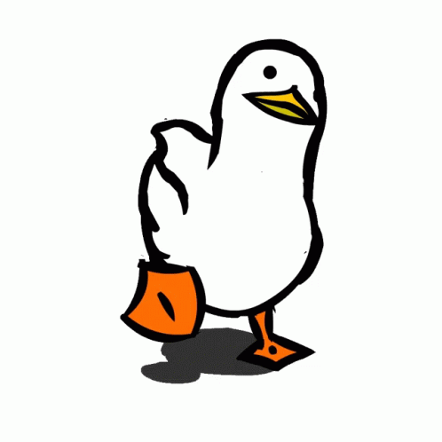

  

<h2 style="color:#0085FF 🧑‍💻 About me </h2>

<table border="0">
  <tr>
    <td>
    <h3 style="color:#0085FF;">Hi, I'm Jefferson 👋</h3>
      - 🇨🇴 From Colombia 🫓, studying <strong>Systems Engineering</strong> at <strong>Universidad Nacional de Colombia</strong>  
      - 🐞 Creating bugs since <strong>2022</strong> (and learning to fix them)  
      - 🌱 Currently learning: <strong>C#</strong> + <strong>DevOps</strong> (Azure ☁️ AWS)  
      - 🎯 2026 goals: build projects that help people... and get an <strong>RTX 5090</strong> to play Paint 🎨  
      - 🎸 Guitar player | 🏍️ Motorcycle rider | 🎮 Achievement hunter (platinuming games)
    </td>
    <td align="center">
      <!-- Reemplaza esta URL con la de tu GIF de pato -->
      
    </td>
  </tr>
</table>

 
        
  </table>

 

        

  <h2 style="color:#0085FF;">🛠️ Tech stack</h2>
  

    
  

 

<!-- Stats -->

  <h2 style="color:#0085FF;">📊 Stats that matter</h2>
  

 

 

  <h2 style="color:#0085FF;">📫 Let's connect</h2>

  

  

  

  

